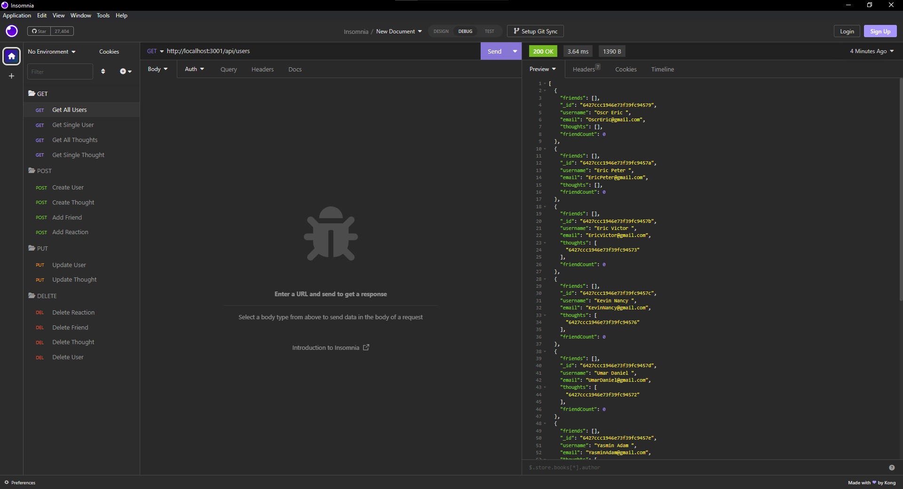

  # Social Network API

  ## Description
This project is an API for a social network web application where users can share their thoughts, react to friends’ thoughts, and create a friend list. You can add/update/delete users/thoughts, add/delete reactions, add/delete friends, and get single users/thoughts.

  ## Table of Contents
  * [Project Links](#links)
  * [Usage](#usage)
  * [Screenshots](#screenshots)
  * [Credits](#credits)
  * [License](#license)
  * [Contributing](#contributing)
  * [Tests](#tests)
  * [Questions](#questions)

  ## Links
  * [Walkthrough Video](https://drive.google.com/file/d/1gLTUCyqeBbsEwTs1oIqraI5li0ajwgrH/view)
  * [GitHub Repo](https://github.com/jeaustins27/Social-Network-API)

  ## Usage
To get started, you will need to clone the repo. Once your repo is cloned, run the command `node utils/seed` in your command line to seed the database. To start the server run `npm start`. Follow the instructional video to learn how to view all users & thoughts, create/delete/update users, create/delete/update thoughts, add/delete reactions, and add/delete friends.

  ## Screenshots
  

  ## Credits
  * [W3Schools](https://www.w3schools.com/)
  * [Readme.so](https://readme.so/)
  * [Stack Overflow](https://stackoverflow.com)
  * [MongoDB](https://www.mongodb.com/)

  
  ## License
  
  
  This project is licensed under the [MIT](https://choosealicense.com/licenses/mit/) license.

    

  ## Contributing
  You can help with contributing by reaching me via email.

  ## Tests
  There are no current tests to be ran.

  ## Questions
  If you have any questions you can reach out via [Email](mailto:JeaustinS27@gmail.com) or you can check out my GitHub profile at here: [GitHub](https://github.com/jeaustins27)
